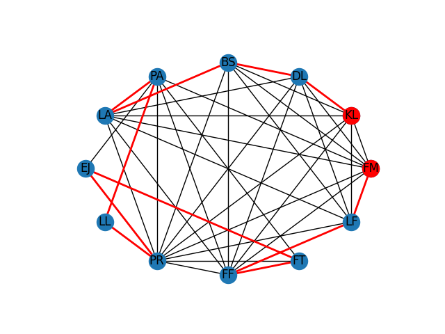

# Secret Santa

<p align="center">
  
</p>

This simple app processes a list of people and pair restrictions to analyze if its
possible a Secret Santa draw and to provide a random solution.

## Quick start

1. Change the [`data/people.txt`](./data/people.txt) and
[`data/pair_exclusions.txt`](./data/pair_exclusions.txt) files content.

2. Install the requirements:

```shell
./scripts/setup-env.sh
```

3. Run the app:

```shell
./scripts/run.sh
```

## Results

Here follow an example of the results you may find by running the app:

```text
people(12) =
['BS', 'DL', 'EJ', 'FF', 'FM', 'FT', 'KL', 'LA', 'LF', 'LL', 'PA', 'PR']

possible pairs(40) =
[['DL', 'BS'],
 ['DL', 'FF'],
 ['DL', 'FM'],
 ['DL', 'KL'],
 ['DL', 'LA'],
 ['DL', 'PR'],
 ['EJ', 'FT'],
 ['FF', 'BS'],
 ['FF', 'FT'],
 ['FM', 'BS'],
 ['FM', 'FF'],
 ['FM', 'KL'],
 ['FM', 'LA'],
 ['FM', 'PR'],
 ['KL', 'BS'],
 ['KL', 'FF'],
 ['LA', 'BS'],
 ['LA', 'FF'],
 ['LA', 'KL'],
 ['LA', 'PR'],
 ['LF', 'BS'],
 ['LF', 'DL'],
 ['LF', 'FF'],
 ['LF', 'FM'],
 ['LF', 'KL'],
 ['LF', 'LA'],
 ['LF', 'PR'],
 ['LL', 'PR'],
 ['PA', 'EJ'],
 ['PA', 'FF'],
 ['PA', 'FM'],
 ['PA', 'FT'],
 ['PA', 'LA'],
 ['PA', 'LL'],
 ['PA', 'PR'],
 ['PR', 'BS'],
 ['PR', 'EJ'],
 ['PR', 'FF'],
 ['PR', 'FT'],
 ['PR', 'KL']]

solution(11) =
[['BS', 'DL'],
 ['DL', 'KL'],
 ['EJ', 'PR'],
 ['FF', 'FT'],
 ['FM', 'LF'],
 ['FT', 'EJ'],
 ['LA', 'BS'],
 ['LF', 'FF'],
 ['LL', 'PA'],
 ['PA', 'LA'],
 ['PR', 'LL']]

people in the solution(12) =
['BS', 'DL', 'EJ', 'FF', 'FM', 'FT', 'KL', 'LA', 'LF', 'LL', 'PA', 'PR']

WARNING: The following people may not give or receive any gift: ['FM', 'KL']
```

<p align="center">
  
</p>
